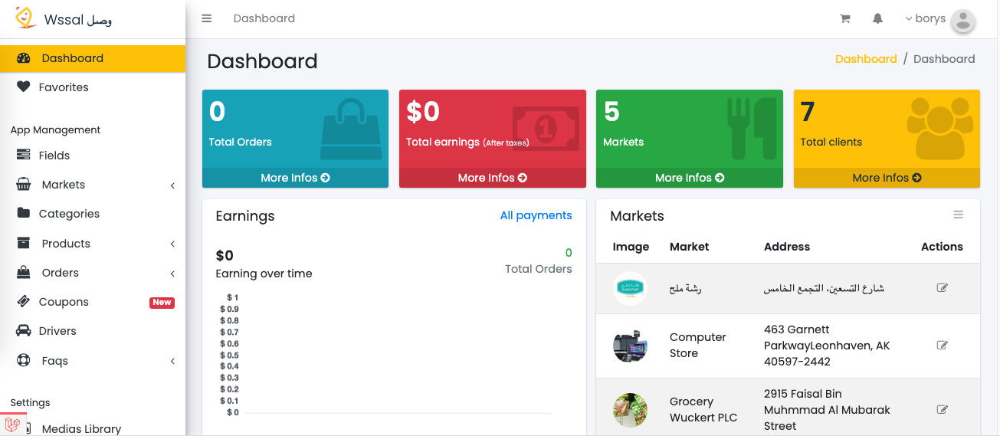
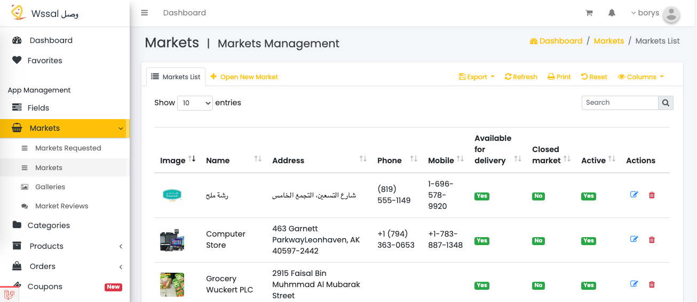
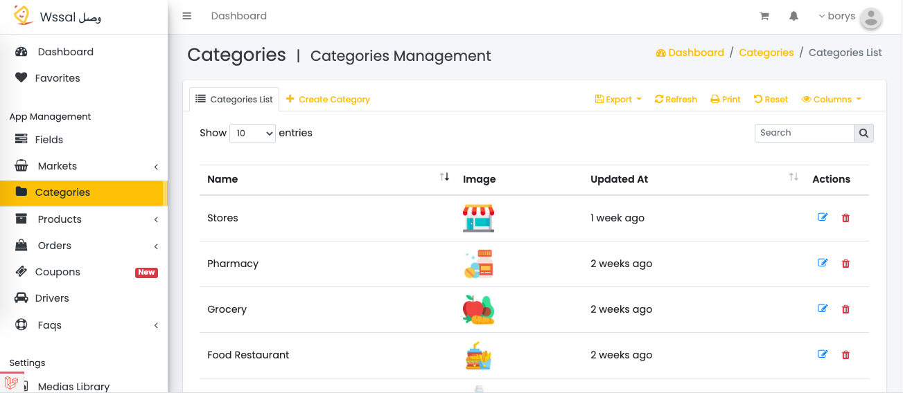

# FoodDelivery-Admin-Laravel

Launch your own grocery, food, pharmacy, store delivery app with a complete dashboard. This is a complete end-to-end solution for launching your own full delivery app. It includes an end user app from which the end users can place an order for products and it includes an admin panel for store owners to accept or manage orders and improve their business. This solution is ideal for anyone who wants to start a product delivery app business.

### Get Started
You should find the folder named /laravel_app zip it and after you sign in to your Bluehost account in the left bar click advanced. and use the file manager to upload this file inside your /public_html  folder .

#### Extract the ZIP file
Click right on your uploaded zip file and choose extract , you should get the following files in your file manager.

#### Create Database
Go to MySQL Databases to create a new database, for example, multi_restaurants and new user and assign this database to the user created (remember the password used in this step we will use it in the installation step.)

#### Installation Wizard
Check Requirements
Open http://yourdomain.com/public/install.

Click "Check requirements" after that.
Change the permission of the following folders to 775.

storage/framework

storage/logs

bootstrap/cache

Use the same credentials of your database created in your domain.

## Screenshot

|                Screenshot               |
|:---------------------------------------:|
|    | 

|                Screenshot               |
|:---------------------------------------:|
|    | 

|                Screenshot               |
|:---------------------------------------:|
|    | 

## About Laravel

Laravel is a web application framework with expressive, elegant syntax. We believe development must be an enjoyable and creative experience to be truly fulfilling. Laravel takes the pain out of development by easing common tasks used in many web projects, such as:

- [Simple, fast routing engine](https://laravel.com/docs/routing).
- [Powerful dependency injection container](https://laravel.com/docs/container).
- Multiple back-ends for [session](https://laravel.com/docs/session) and [cache](https://laravel.com/docs/cache) storage.
- Expressive, intuitive [database ORM](https://laravel.com/docs/eloquent).
- Database agnostic [schema migrations](https://laravel.com/docs/migrations).
- [Robust background job processing](https://laravel.com/docs/queues).
- [Real-time event broadcasting](https://laravel.com/docs/broadcasting).

Laravel is accessible, powerful, and provides tools required for large, robust applications.
